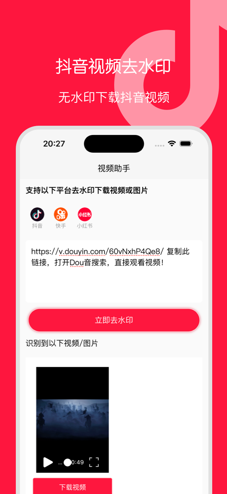
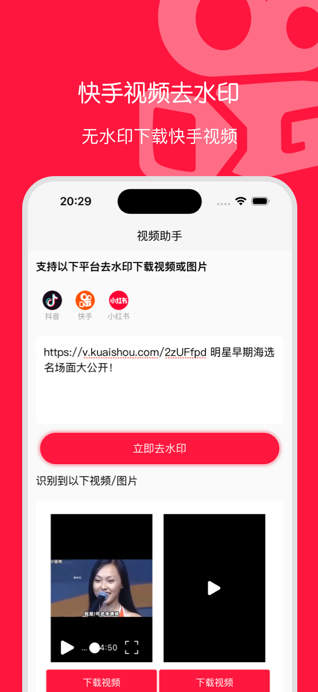
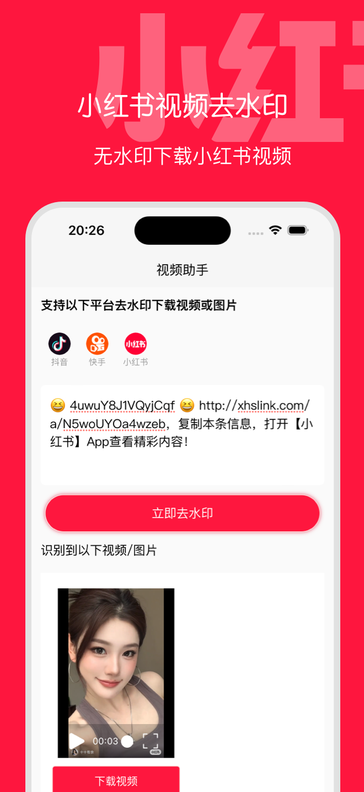

# 视频助手 📱

> 一款专业的短视频下载工具，支持抖音、快手、小红书等主流平台

## ✨ 功能特色

- 🎯 **多平台支持**：支持抖音、快手、小红书等热门短视频平台
- 🚫 **无水印下载**：自动去除视频水印，获得纯净视频文件
- 📋 **智能识别**：复制分享链接即可自动识别视频信息
- ⚡ **快速下载**：高速下载，节省等待时间
- 📱 **界面友好**：简洁直观的用户界面，操作简单易懂
- 💾 **本地保存**：视频直接保存到手机相册或指定文件夹

## 🚀 使用方法

1. **复制链接**：在抖音/快手/小红书等平台复制视频分享链接
2. **打开APP**：启动视频助手应用
3. **粘贴链接**：将复制的链接粘贴到APP中
4. **一键下载**：点击下载按钮，等待下载完成

## 📥 下载安装

### Android
- [📱 直接下载 APK](链接待更新)
- 文件大小：约 15MB
- 系统要求：Android 6.0 及以上

### iOS
- 🍎 即将上线 App Store

## 📸 应用截图

## ❓ 常见问题

### Q: 支持哪些视频平台？
A: 目前支持抖音、快手、小红书三大主流短视频平台，后续会根据用户需求增加更多平台。

### Q: 下载的视频有水印吗？
A: 本应用会自动处理并提供无水印的视频文件。

### Q: 视频下载速度如何？
A: 下载速度取决于您的网络环境和视频大小，通常情况下几秒钟即可完成下载。

### Q: 是否支持批量下载？
A: 当前版本支持单个视频下载，批量下载功能正在开发中。

### Q: 下载的视频保存在哪里？
A: 用户可以在相册中找到下载的视频。

### Q: 应用是否免费？
A: 是的，视频助手完全免费使用，无需任何费用。

### Q: 下载失败怎么办？
A: 请检查网络连接，确认链接有效性，或者尝试重新复制链接。如问题持续存在，请联系客服。

## 🛡️ 使用声明

- ⚖️ 本工具仅供个人学习和研究使用
- 📝 请遵守相关平台的使用条款和版权规定
- 🚫 禁止用于商业用途或传播他人作品
- ✋ 下载的内容版权归原作者所有

## 📞 联系我们

- 📧 邮箱：pmwangping@gmail.com
- 🌐 官网：shipin.imdaxia.com

## 🔄 更新日志

### v1.0.0 
- 🎉 首次发布
- ✅ 支持抖音、快手、小红书视频下载
- ✅ 无水印处理功能
- ✅ 智能链接识别

## ⚠️ 重要说明

**本项目为闭源项目，不提供源代码。**

如需使用本应用，请通过上述下载链接获取安装包。我们致力于为用户提供最佳的使用体验，感谢大家的支持！

---

⭐ 如果觉得这个项目有用，请给我们一个 Star！

📢 欢迎关注我们的更新，第一时间获取新功能和优化！